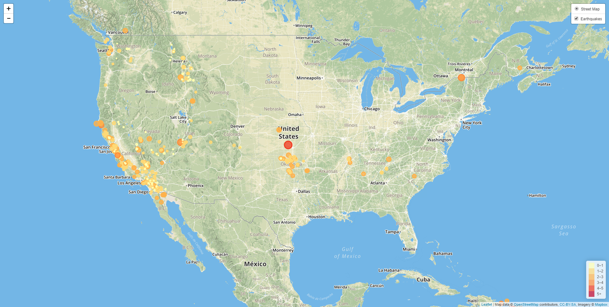

# Earthquake-Visualization
Using an api from the USGS, I have pulled data about earthquakes that have happened around the world in the past week. The program will always make this api call when someone runs it, and when someone runs it they will see that I have created a local webpage that shows a geographical map of all the earthquakes that occured in the past week. Each earthquake is color coded based on their magnitude.

# Getting Started
Follow this step-by-step process in order to make a copy of this project on your local machine. Then you are free to explore and improve the application to your heart's content.

# Installing:
1. Clone the repository using either HTTPS or SSH. (I recommend to use SSH if you already have a protected SSH Key set up.)
2. Open GitBash on your local machine where you would like to store your cloned repository.
3. Type in the command "git clone <paste in the clone repository>" and hit enter.
4. Type in either your SSH Key or your Github login to proceed cloning the repository to your local machine.
5. Ta-Da. You have successfully cloned the repository.
  
# Running the Application
Once you have the repository cloned, then click on the folder of the name of the repository (None of this is in GitBash) and click on the index.html file, which will look like the chrome browser logo. This will automatically open your browser to your local machine and you will be running the application and see a geographical maps with all colored dots that represent all the earthquakes around the world that occured exactly one week from when you ran this application.

# Built With
* HTML
* JavaScript
* CSS
* [Leaflet](https://leafletjs.com/)
* [D3](https://d3js.org/)
