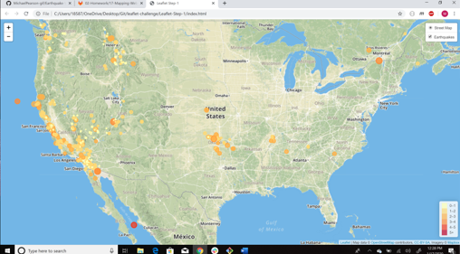

# Earthquake-Visualization
Using an api from the USGS, I have pulled data about earthquakes that have happened around the world in the past week. The program will always make this api call when someone runs it, and when someone runs it they will see that I have created a local webpage that shows a geographical map of all the earthquakes that occured in the past week. Each earthquake is color coded based on their magnitude.

